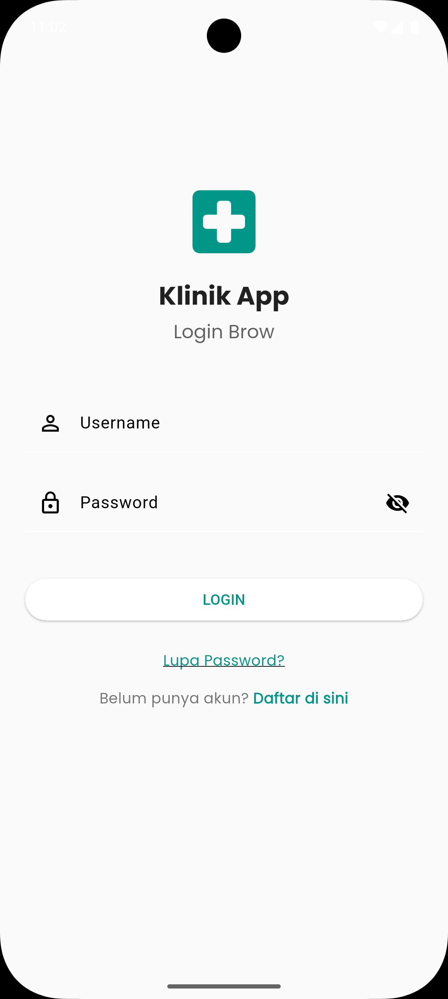
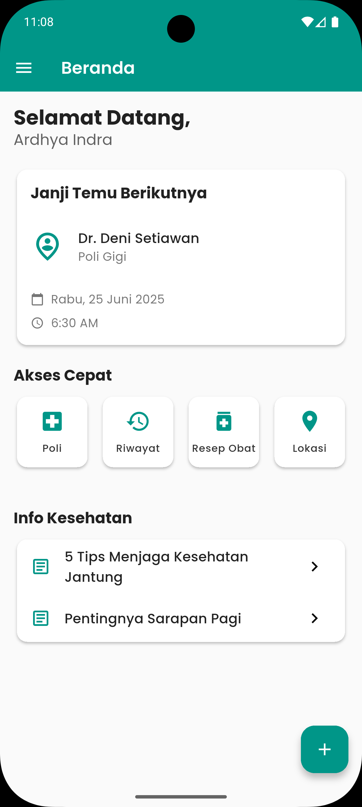
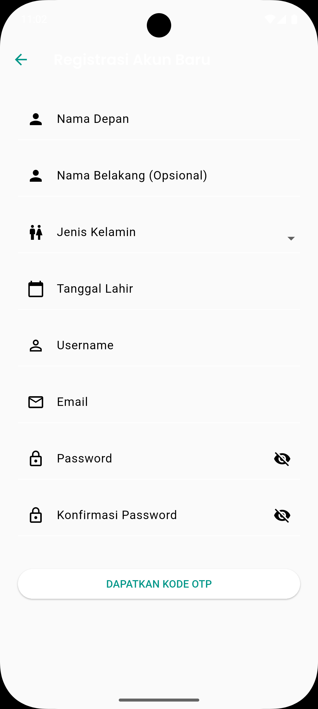
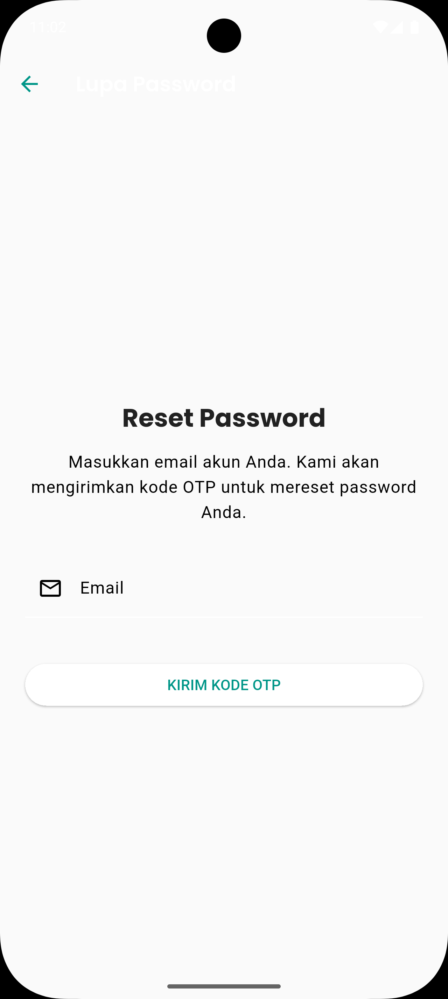
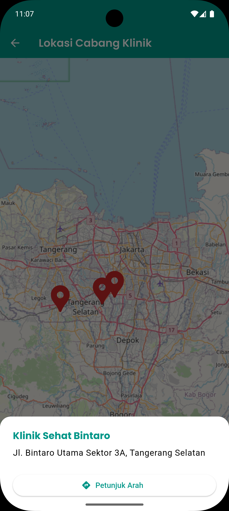

# 🏥 Klinik App - A Full-Stack Clinic Management Application

**Klinik App** is a cross-platform mobile application designed to digitize clinic services, using **Flutter** for the frontend and **Node.js (Express.js)** for the backend.

---

## ✨ Key Features

### 👥 For Users (Patients)
- 🔐 **Secure Authentication**  
  - Email OTP Verification  
  - Session-based login  
  - Forgot password flow with email OTP

- 📆 **Appointment System**  
  - View upcoming appointments  
  - Create appointment with cascading dropdown: select "Poli" → list available doctors

- 📋 **Riwayat & Resep Obat**  
  - View appointment history  
  - View previous prescriptions

- 🗺 **Interactive Location Map**  
  - Show clinic branches using OpenStreetMap  
  - Detect user location via GPS

- 🎨 **User Profile & Themes**  
  - View profile info  
  - Support for light/dark mode

---

### 🛠️ For Admin (via Role-based Access)
- 👤 Role-based access using JWT & session
- 📂 CRUD management for:
  - Poli (Clinic Specializations)
  - Dokter (Doctors)
  - Pegawai (Employees)
- 🧩 Admin menu is shown only for users with admin role

---

## 📱 Screenshots

| Login | Home | Profile |
|------|------|---------|
| ) |  |  |

| Riwayat | Booking | Map |
|---------|---------|-----|
|  |  |

---

## 🧰 Tech Stack

### 🔵 Frontend (Flutter)
- Flutter & Dart
- `provider` for state management
- `dio` + `dio_cookie_manager`
- `flutter_dotenv` for env config
- `flutter_map` + `latlong2`
- `geolocator`, `intl`, `url_launcher`

### 🟢 Backend (Node.js)
- Express.js + MySQL
- `express-session`, `dotenv`, `bcryptjs`
- `nodemailer` for OTP email
- `mysql2` for DB connection

---

## ⚙️ Installation & Setup

### 🔹 Backend Setup
```bash
git clone https://github.com/yourusername/flutter-klinik-app.git
cd flutter-klinik-app/backend
npm install
```

#### 🛠 Setup Database:
1. Buat DB `klinik_app` di MySQL
2. Import struktur tabel (bisa dari file SQL atau manual)

#### 🗂 Buat file `.env` di `/backend`
```env
DB_HOST=localhost
DB_USER=root
DB_PASSWORD=
DB_NAME=klinik_app

SESSION_SECRET=yourSecretKey
SESSION_MAX_AGE=86400000
PASSWORD_PEPPER=someSuperSecretKey

EMAIL_USER=youremail@gmail.com
EMAIL_PASS=your16DigitAppPassword
```

#### ▶️ Jalankan Server
```bash
node index.js
```

---

### 🔹 Frontend Setup
```bash
cd ../frontend
flutter pub get
```

#### 🗂 Buat file `.env` di `/frontend`
```env
BASE_URL=http://10.0.2.2:3000
```

#### Tambahkan di `pubspec.yaml`
```yaml
flutter:
  assets:
    - .env
```

#### ▶️ Jalankan App
```bash
flutter run
```

---

## 🗂 Project Structure

```
projectUas/
├── backend/
│   ├── src/
│   │   ├── routes/
│   │   ├── controllers/
│   │   ├── services/
│   │   └── models/
│   └── .env
├── frontend/
│   ├── lib/
│   │   ├── ui/
│   │   ├── model/
│   │   ├── service/
│   │   └── helpers/
│   └── .env
└── README.md
```

---

## 👤 Contributor

- Ardhya Indra Rajasa


